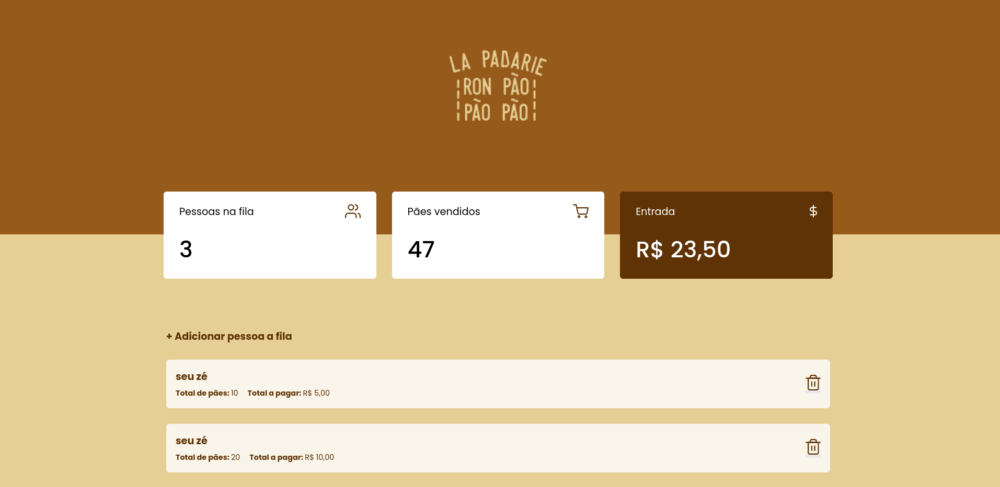

<h1 align="center">La-Padarie</h1>

## Descrição do Projeto

Projeto desenvolvido durante o Núcleo de estudos Web da [InfoJr UFBA](https://br.linkedin.com/company/infojrufba) com o objetivo de introduzir à manipulação do DOM com o JavaScript e reforçar os conhecimentos em HTML e CSS. Consiste num site *single-page* que simula um sistema de venda de pães de uma padaria.

## :hammer: Funcionalidades

- Adicionar e remover clientes na fila, especificando a quantide de pães comprados.
- Acompanhar o status das vendas através dos cards informativos.

## :books: Tecnologias Utilizadas

- JavaScript
- HTML
- CSS

## 📁 Acesso ao Projeto

Foi feito o deploy do site pela plataforma [Netlify](https://www.netlify.com/) e você pode acessá-lo através desse [link](https://loving-bhaskara-ab470d.netlify.app/).
